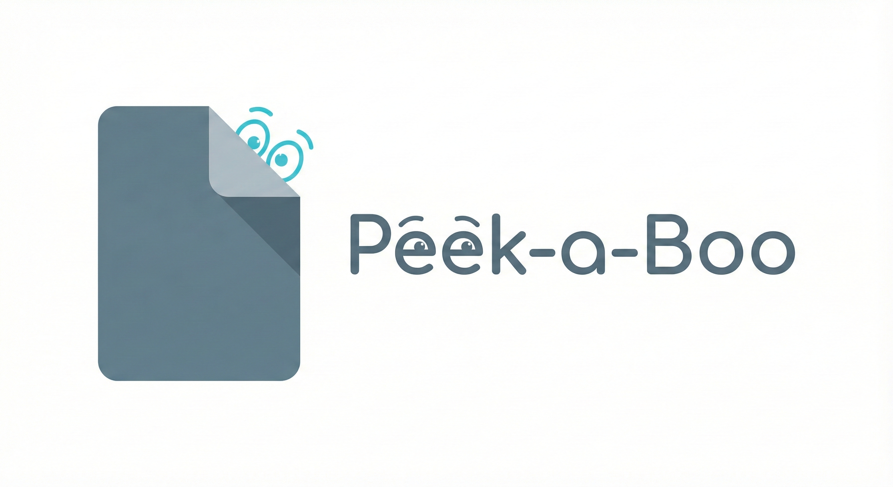

<div align="center">
  

  # Peek-a-Boo Agent

  A minimalist AI agent that extracts information from files using surgical operations to minimize token usage.
</div>

## Setup

```bash
python3 -m venv venv
source venv/bin/activate
pip install -r requirements.txt
```

## Configuration

Create a `.env` file with your Google API key:

```
GOOGLE_API_KEY=your_api_key_here
```

## Usage

```bash
python3 main.py
```

The test suite offers 4 missions:
1. **Find Stripe API Key** - Search for hidden credentials
2. **Find TODO/FIXME** - Automated code review
3. **Find API endpoint** - Configuration discovery
4. **Find all credentials** - Security audit

### Example Run

Below is a screenshot of the agent running one of the missions to find credentials within the test project.


## Philosophy

The agent follows the "token saving" principle - it NEVER reads entire files unless strictly necessary.

### Available Tools

| Tool | Function | Use Case |
|------|----------|----------|
| **ListFiles** | List files in a directory (non-recursive) | Initial orientation |
| **FindFiles** | Search files by glob pattern (`*.env`, `*secret*`) recursively | Find specific file types |
| **ReadPreview** | Show first 5 + last 5 lines | Understand file structure |
| **GrepSearch** | Search keyword in ONE file with context | Surgical extraction |
| **GrepRecursive** | Search keyword in ALL files of a directory | Global search |

### Surgical Strategy

```
Looking for a FILE TYPE    → FindFiles with pattern
Looking for a KNOWN KEYWORD → GrepSearch on specific file
Looking for an UNKNOWN KEYWORD → GrepRecursive on directory
```

### Regex Support

All search tools support regex with `use_regex=True`:
```python
GrepRecursive(directory=".", keyword="sk_live_[0-9]+", use_regex=True)
```

## Project Structure

```
Peek-a-Boo/
├── agent.py        # Agent configuration + system prompt
├── tools.py        # 5 surgical tools
├── main.py         # Test suite with 4 missions
├── .env            # API key (create this)
└── messy_project/  # Test directory (auto-generated)
```

## Safety Limits

Tools have built-in limits to prevent token explosions:
- **ListFiles**: max 30 entries
- **FindFiles**: max 20 results
- **ReadPreview**: max 50MB per file
- **GrepSearch**: max 3 matches per file
- **GrepRecursive**: max 10 files, max 5 total matches

Automatically ignored directories: `.git`, `node_modules`, `__pycache__`, `venv`, `.idea`, `.vscode`

## Built With

- [Datapizza](https://github.com/datapizza/datapizza) - AI agent framework
- [Google Gemini](https://ai.google.dev/) - LLM backend (`gemini-2.0-flash-exp` model)

## License

MIT
